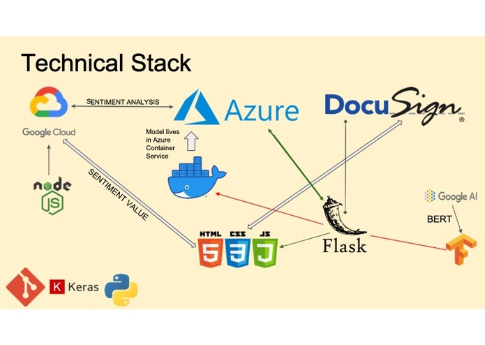
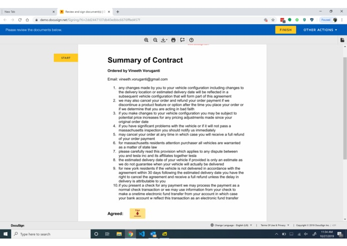
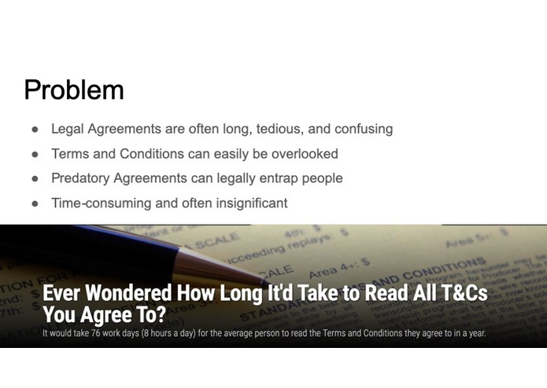
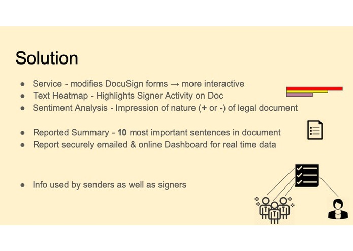
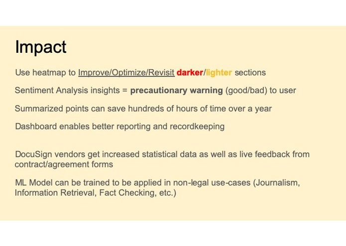
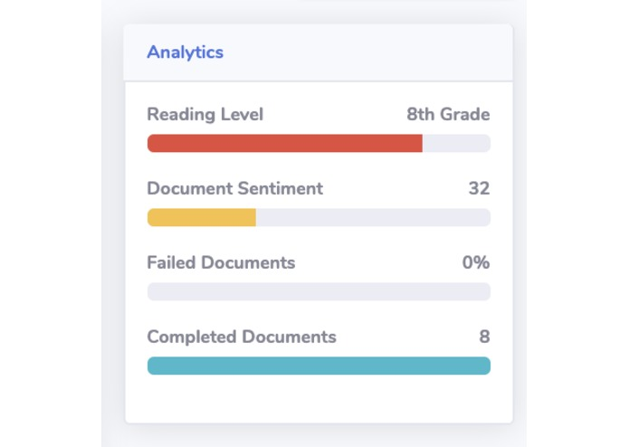

<h1 align="center"><a href="https://devpost.com/software/cosine-bgxpea">Devpost Link</a></h1>

## Inspiration
Improve the way Terms and Conditions, Service Agreements, Legal Contracts are presented, reviewed, accepted by everyday people. Serve companies with insights to better their forms and TOC.  
 
## What it does
Cosine improves upon features of the DocuSign API to provide useful and important analytics to the signer and the sender of a particular document/contract/agreement.  
It tracks user (signer) activity onscreen while they are reading the document and generates a heatmap on the sender's end, highlighting areas of the document with most time spent on them in red, those with fewer time spent on them in yellow, and those with none or little time - blank.  
Cosine takes these blank areas of the document and sends the data to an in-house cloud hosted Machine Learning model which analyzes this data to find the top 10 important sentences/phrases/paragraphs and returns this information to the user (signer) in the form of a pdf document which is emailed to them for review. In the meantime, Cosine has already analyzed the entire original document and returned information such as the reading grade level, sentimentality, etc. of the document's text content, to the sender so that they can use this information to improve upon their document(s).  

## How we built it
Deployed a Flask App to Azure Container Service for hosting the ML model that returns the top 10 most important sentences in the legal document.  
Created a signer dashboard and a sender dashboard containing respective live data insights and the document to view anytime.  
Used the Azure Sentiment Analysis Text Analytics API to detect the sentiment used in different paragraphs within the legal document.  
Used the **DocuSign eSignature API** to send an _email_ to the signer containing a summarized version of the agreement along with some insights about the document.  
Fine-tuned BERT using TensorFlow to better understand legal data and used a PageRank + Cosine Similarity inspired algorithm to develop an extractive summarizer.  
Used a Google Cloud Function to analyze data returned from the Sentiment Analysis Text Analytics API to determine a sentiment score for the legal document.  

## Challenges we ran into
Azure - Poor documentation, limited setup options and large setup time  
Promise functions and their implementation on a serverless function performing multiple API requests    
Python versions - Different versions of python configure apps and their environments to behave differently making installations and debugging a challenging task  
Cal WiFi - Mysterious forces in the PG&E and the Cal Memorial Stadium conspired to lay waste to the CalVisitor and eduroam WiFi networks  
Deep learning model - Building and deploying a server to host a model > 400MB in size so that there isn't a need to reload the graph every time a prediction is required. Also, finding computing power to handle such requests.  
The DocuSign API - Challenging to find a means to track user activity in an embedded DocuSign element. 

 
## Accomplishments that we're proud of
• No force pushes to Git!  
• Building a Machine Learning model.  
• Our great-to-look-at and simplistic yet powerful UI.  

## What we learned
• Using the DocuSign eSignature API.  
• Navigating the Azure Platform and leveraging its various services, particularly the Azure Container Service, its CLI, and the App Function Service.  
• The ubiquitousness of iframe.   
 
## What's next for Cosine

Implementing more analytical insights that can help to improve the summarization model. This will continuously improve the quality of the product that the end user sees.

  

 

  

 

  

 

  

 

  

 

  

 

  

 

